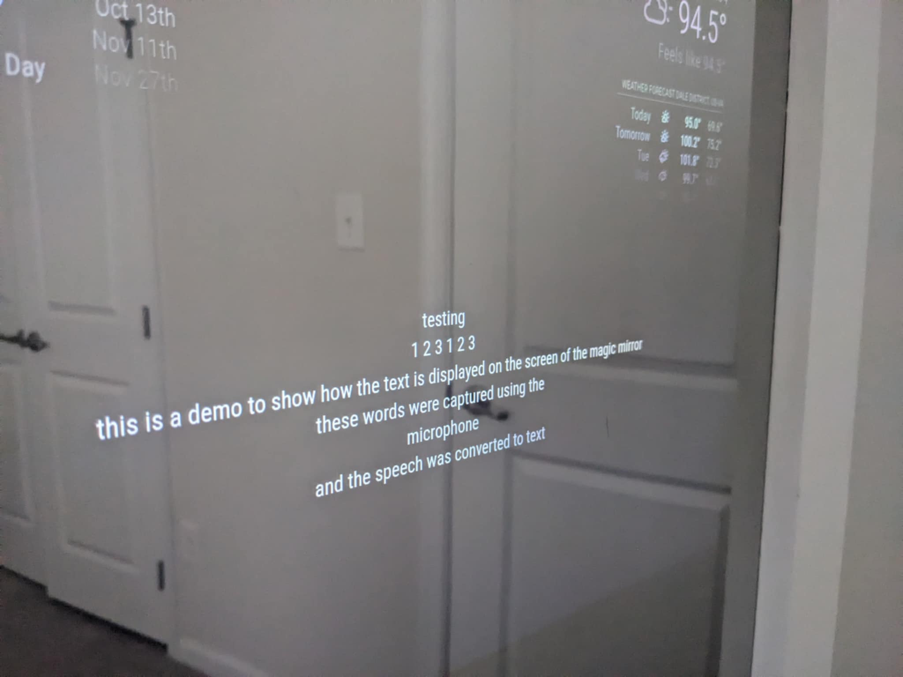
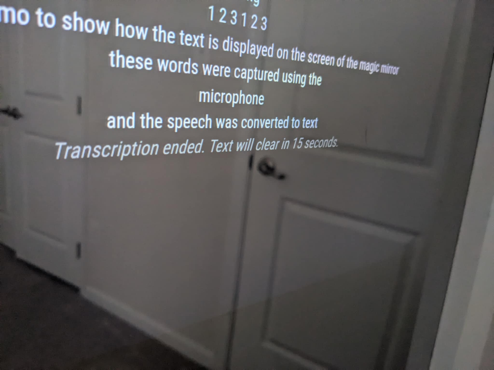
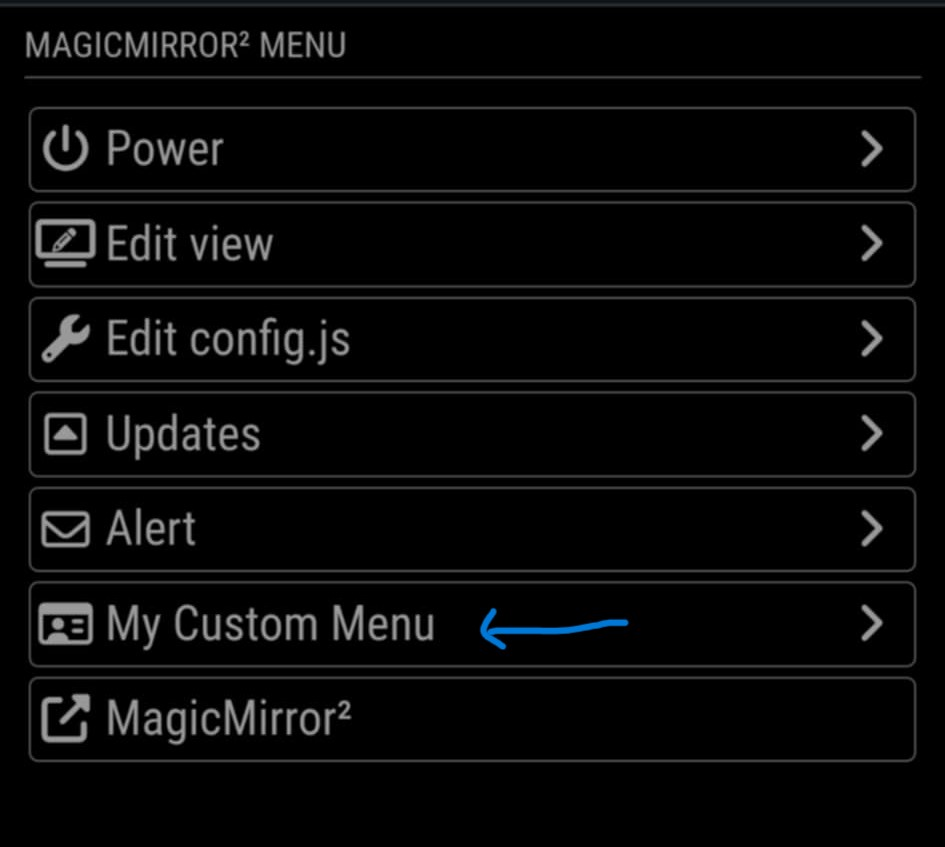
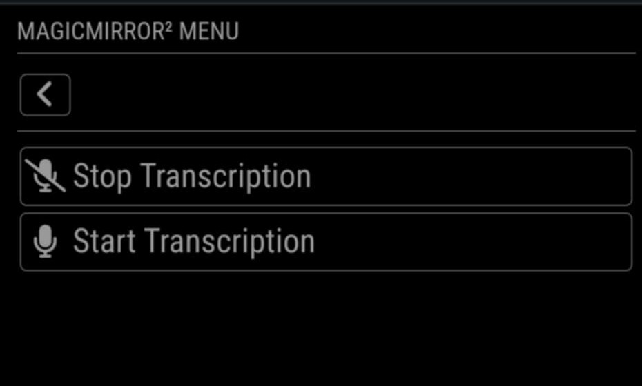

# ✍️ MMM-Jot

**MMM-Jot** is a voice-to-text transcription module for MagicMirror². It listens for live speech input, transcribes it in real time using **Google Cloud Speech-to-Text**, and displays the output on your mirror.


## 📌 Features

* 🎙️ Live speech transcription using [Google Cloud Speech-to-Text](https://cloud.google.com/speech-to-text/docs/transcribe-streaming-audio)
* 🔄 Live partial updates + finalized text
* ⏳ Auto-clears transcript after configurable delay (with live countdown)
* 📃 Transcribed conversations saved into txt files for 24 hours before deletion
* 🔔 Start/stop listening via notifications (e.g. from `MMM-Remote-Control` or other modules)






## 🧰 Installation

### 1. Clone the module

```bash
cd ~/MagicMirror/modules
git clone https://github.com/yourusername/MMM-Jot.git
cd MMM-Jot
npm install
```

### 2. Set up Google Cloud Speech-to-Text

This module uses [Google Cloud Speech-to-Text's streaming API](https://cloud.google.com/speech-to-text/docs/transcribe-streaming-audio) to convert audio to text.

#### ✅ Steps to configure:

1. Go to [https://console.cloud.google.com/](https://console.cloud.google.com/) and create a new project.
2. Enable the **Speech-to-Text API** for that project.
3. In the sidebar, go to **IAM & Admin > Service Accounts**.
4. Click **Create Service Account** and give it a name (e.g., `speech-transcriber`).
5. Grant it the **"Editor"** or **"Cloud Speech Client"** role.
6. After creation, click the account → **"Keys"** tab → **"Add Key"** → **"Create new key"** → Choose `JSON`.
7. Download the `.json` key file.

#### 📁 Folder setup:

Create a folder called `key` in `MMM-Jot` and place the JSON key inside it:

```
MMM-Jot/
├── key/
│   └── service-account.json
```

Make sure your code uses this file for Google authentication.

#### 🧾 Light Note on Pricing:

Google offers **60 minutes of free speech recognition per month**. After that, it charges based on usage (usually \~\$0.006 per 15 seconds of audio for standard models). [View pricing](https://cloud.google.com/speech-to-text/pricing)


## ⚙️ Configuration

Add this to your `config.js`:

```js
{
  module: "MMM-Jot",
  position: "top_left",
  config: {
    maxLines: 15,       // Number of lines to keep visible
    clearDelay: 30000   // 30 seconds. Time (ms) before clearing the screen after transcription ends
  }
}
```

### 🔧 Options

| Option       | Type  | Default | Description                                                                  |
| ------------ | ----- | ------- | ---------------------------------------------------------------------------- |
| `maxLines`   | `int` | `15`    | Max number of final lines shown                                              |
| `clearDelay` | `int` | `30000` | How long (in ms) to wait before clearing the screen after transcription ends |

---

## 🚀 Usage

### 🧠 Starting and Stopping Transcription

MMM-Jot listens for the following MagicMirror notifications:

* `START_LISTENING`
* `STOP_LISTENING`

The easiest way to trigger these is via the **[MMM-Remote-Control](https://github.com/Jopyth/MMM-Remote-Control)** module, which lets you send these commands from a browser interface or API:

```bash
http://<your-mirror-ip>:8080/remote?action=NOTIFICATION&notification=START_LISTENING
http://<your-mirror-ip>:8080/remote?action=NOTIFICATION&notification=STOP_LISTENING
```

> 🛠 MMM-Remote-Control is **recommended** as a trigger method, but you can also send notifications from any other custom module or automation tool.

---

## 📂 File Overview

| File             | Purpose                                              |
| ---------------- | ---------------------------------------------------- |
| `MMM-Jot.js`     | MagicMirror frontend display module                  |
| `node_helper.js` | Backend logic for recording & streaming              |
| `MMM-Jot.css`    | Optional styles                                      |
| `key/`           | Folder to store your Google service account JSON key |
| `logs/`          | Folder where transcriptions are saved as `.txt` files (auto-cleaned after 24h) |

---

## ✅ Example Flow

1. You send a `START_LISTENING` notification.
2. The microphone starts recording.
3. Transcription appears on screen in real-time.
4. After a `STOP_LISTENING` signal, transcription ends.
5. A visible countdown appears (e.g., "Text will clear in 30 seconds...").
6. Text clears automatically after the delay.


## 📦 Transcription Logs

All completed transcriptions are also saved as `.txt` files in a local `logs/` folder inside the `MMM-Jot` directory. Each file is timestamped based on the time the transcription session started.

```bash
MMM-Jot/
├── logs/
│   └── conversation-2025-06-22T19-05-08-188Z.txt
```


## 👨‍🔧 Requirements

* Microphone connected to your Raspberry Pi (USB or Pi-compatible)
* Internet access (to reach Google Cloud)
* A Google Cloud account + valid service account key

---

## 🕹️ Optional : Integrate with MMM-Remote-Control (Custom Menu)

To make it easy to start and stop transcription from the [Remote Control interface](https://github.com/Jopyth/MMM-Remote-Control), you can create custom buttons using its built-in **Custom Menu** support.




### ✅ Prerequisite

Make sure you have `MMM-Remote-Control` installed and configured in your `config.js` like so:

```js
{
  module: 'MMM-Remote-Control',
  position: 'bottom_right',
  config: {
    customMenu: "custom_menu.json"  // this file will be created next
  }
}
```

---

### 📄 Step-by-Step: Add Transcription Controls

1. Go to your MagicMirror's `config/` folder:

   ```bash
   cd ~/MagicMirror/config
   ```

2. Create a file named `custom_menu.json` (or copy the example):

   ```bash
   cp ../modules/MMM-Remote-Control/custom_menu.example.json custom_menu.json
   ```

3. Edit `custom_menu.json` to add the `Start Transcription` and `Stop Transcription` buttons:

```json
{
  "id": "custom",
  "type": "menu",
  "icon": "id-card-o",
  "text": "%%TRANSLATE:CUSTOM_MENU%%",
  "items": [
    {
      "id": "custom-item-1",
      "type": "item",
      "icon": "microphone",
      "text": "Start Transcription",
      "action": "NOTIFICATION",
      "content": {
        "notification": "START_LISTENING",
        "payload": {
          "clearDelay": 300000
        }
      }
    },
    {
      "id": "custom-item-2",
      "type": "item",
      "icon": "microphone-slash",
      "text": "Stop Transcription",
      "action": "NOTIFICATION",
      "content": {
        "notification": "STOP_LISTENING",
        "payload": null
      }
    }
  ]
}
```


---

### 🚀 Result

You’ll now see a **"Custom"** menu tab in the Remote Control interface, with buttons for:

* ▶️ **Start Transcription**
* ⏹️ **Stop Transcription**

 Clicking these will trigger the corresponding `MMM-Jot` actions.


## 📄 License

MIT License – free to use and modify.

